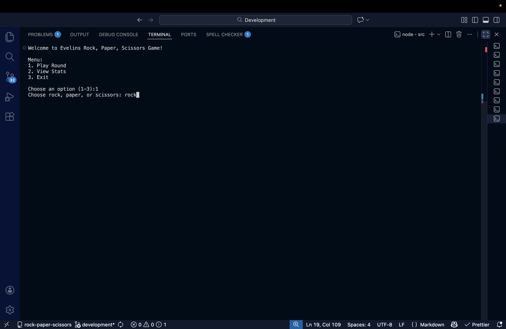

# CLI App

Find instructions for completing this project at the [Marcy Lab School Docs](https://marcylabschool.gitbook.io/marcy-lab-school-docs/mod-1-javascript-fundamentals).

Once you've completed the project, replace this content with a description of the project, an explanation of the available functionality with usage examples, and clear setup instructions. For an example, look at the README.md file in the [Task Manager Case Study](https://github.com/The-Marcy-Lab-School/swe-casestudy-1-cli-task-manager).

## Project Overview

This project is a simple command-line game where users play with the computer. The application gives users options through prompts to choose rock, paper, or scissors and uses static methods so the computer randomly chooses one of the three. Then a winner is chosen by comparing both choices. The application also stores the stats of the user in an object which is updated base on the outcome of each game.

### Key Feature & Usage Example

After running the application, the user is presented with a menu of options. They can:

1. Play a game with the computer
2. View their stats (wins, losses, ties, and win rate)
3. Exit the application

In the screenshot below, you can see the user selecting the "Play Round" option and entering their choice of "rock".



### Setup

Follow these steps to get started:

```sh
# Clone the repo
git clone [repo_url]
cd [repo_name]

# Install dependencies
npm install

# Run the src/index.js file
node src/index.js

# Or, you can use the start command shortcut
npm start

# Or, run in developer mode using nodemon
npm run dev
```

## Key Technologies & Packages

- Node
- `prompt-sync`
